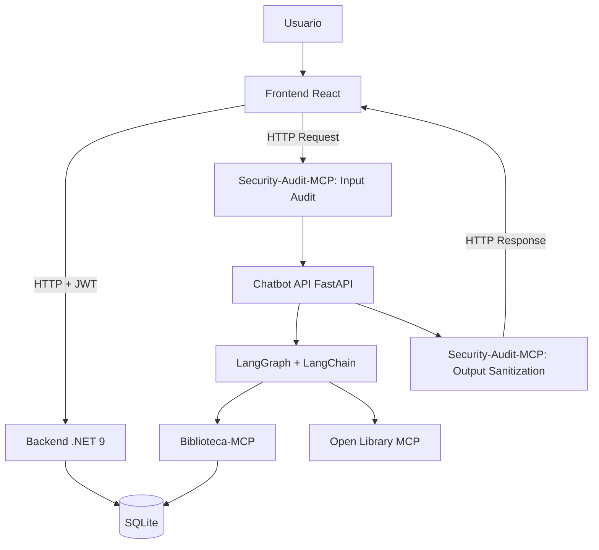

Trabajo Práctico Integrador — Sistema Web Fullstack con Deployment Docker alineado.

---

## 1. Descripción general

**Biblioteca Virtual Inteligente** es una aplicación web full stack diseñada para gestionar una biblioteca virtual. Permite administrar usuarios, roles, catálogo de libros, alquileres y notificaciones de vencimiento.

Como diferencial, integra un **chatbot inteligente** desarrollado con **LangChain + LangGraph**, apoyándose en el protocolo **MCP (Model Context Protocol)** para aislar la lógica de negocio y auditar la seguridad.

### Alcance Funcional (10 Casos de Uso Core)
1. Registro de cuenta (Público)
2. Inicio de sesión (JWT)
3. Gestión de roles y permisos (Admin)
4. Interfaz condicionada por roles y permisos (UX)
5. Búsqueda y filtrado de libros en catálogo
6. CRUD completo de libros (Admin/Bibliotecario)
7. Alquiler de libros con fecha límite de devolución
8. Generación automática de notificaciones de vencimiento próximo
9. Registro de devoluciones y liberación de stock
10. Chatbot inteligente con memoria persistente y grafo conversacional

---

## 2. Arquitectura Base



---

## 3. Desarrollo Evolutivo (AI Engineering)

Cada funcionalidad o cambio sigue un flujo orquestado por agentes:
`create-user-story` → `plan-user-story` → `approve-user-story` → `implement-user-story` → `qa-check` (ver guía de comandos en la tabla).

| Fase | Comando | Estado MCP | Restricción |
|---|---|---|---|
| 1. Entrada | `create-user-story "..."` | Draft | ID único incremental |
| 2. Plan | `plan-user-story US-XXX` | Planned | No tocar código; definir rama `tipo/US-XXX-descripcion` |
| 3. Aprobación | `approve-user-story US-XXX` | Approved | Autorización explícita de implementación |
| 4. Implementación | `implement-user-story US-XXX` | In Progress → Implemented | Solo con estado Approved/Rejected |
| 5. QA | `qa-check US-XXX` | Validated/Rejected | Indexa, valida, abre PR hacia main |

---

## 4. Stack Tecnológico

- Frontend: React, TypeScript, Tailwind CSS.
- Backend: C#, . NET 9, ASP.NET Core Web API, EF Core, SQLite.
- IA: Python, FastAPI, LangChain, LangGraph.
- Orquestación: MCP, Docker Compose.

---

## 5. Estructura del Repositorio

```
├── docker-compose.yml
├── .env.example
├── workflow/
│   ├── backend/   # .NET 9 Clean Arquitecture
│   ├── frontend/  # React + Vite + nginx.conf
│   ├── chatbot/   # FastAPI
│   ├── mcp/       # servers MCP
│   ├── database/  # SQLite
│   └── opencode/  # historias y logs AI engineering
```

---

## 6. Prerrequisitos

Copia `.env.example` a `.env` y completa:

```env
GITHUB_TOKEN=ghp_tu_token_aqui
DATABASE_PATH=./workflow/database/BibliotecaVirtual.db
JWT_KEY=           # openssl rand -base64 48
ADMIN_EMAIL=admin@biblioteca.local
ADMIN_PASSWORD=
```

---

## 7. Ejecución con Docker

```bash
cp .env.example .env
# ajustar JWT_KEY y ADMIN_PASSWORD

docker compose up --build
```

| Servicio | URL |
|---|---|
| Frontend | http://localhost:5173 |
| Backend API | http://localhost:5000 |
| Chatbot API | http://localhost:8000 |

---
