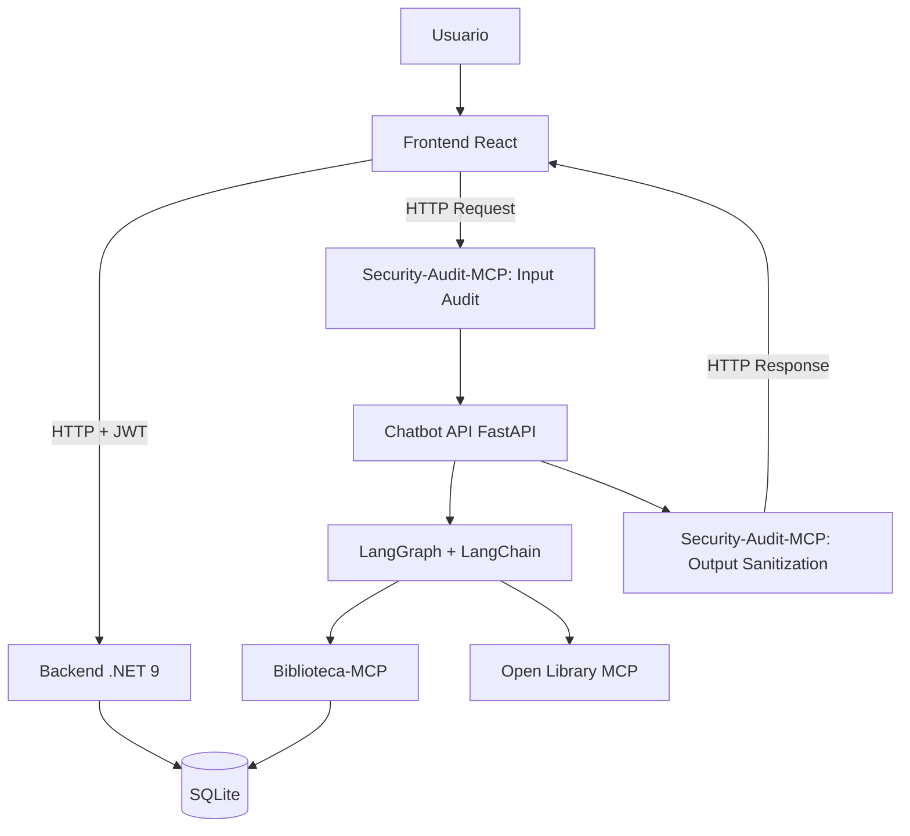

Trabajo Práctico Integrador — Sistema Web Fullstack con AI Engineering, MCP y Chatbot basado en Grafo.

---

## 1. Descripción general

**Biblioteca Virtual Inteligente** es una aplicación web fullstack diseñada para gestionar una biblioteca virtual. Permite administrar usuarios, roles, catálogo de libros, alquileres y notificaciones de vencimiento.

Como diferencial, integra un **chatbot inteligente** desarrollado con **LangChain + LangGraph**, apoyándose en el protocolo **MCP (Model Context Protocol)** para aislar la lógica de negocio y auditar la seguridad.

### Alcance Funcional (10 Casos de Uso Core)
1. Registro de cuenta (Público)
2. Inicio de sesión (JWT)
3. Gestión de roles y permisos (Admin)
4. Interfaz condicionada por roles y permisos (UX)
5. Búsqueda y filtrado de libros en catálogo
6. CRUD completo de libros (Admin/Bibliotecario)
7. Alquiler de libros con fecha límite de devolución
8. Generación automática de notificaciones de vencimiento próximo
9. Registro de devoluciones y liberación de stock
10. Chatbot inteligente con memoria persistente y grafo conversacional

---

## 2. Arquitectura Base


    
---

## 3. Desarrollo Evolutivo (AI Engineering)

Este proyecto se desarrolla de forma incremental mediante flujos automatizados de agentes de IA (OpenCode). No se escribe código de forma descontrolada, todo pasa por un estricto pipeline de aprobación.

### Ciclo de Vida de las Historias de Usuario
Cada nueva funcionalidad o requerimiento sigue de manera obligatoria esta secuencia orquestada mediante comandos específicos en el modo **Build**:

1. **Requerimiento (`create-user-story`)** El usuario ingresa una necesidad anteponiendo el comando.
2. **Historia de Usuario** El *Technical Lead* crea el archivo físico de la historia (`US-XXX`). El *Functional Analyst* redacta los criterios de aceptación y reglas de negocio.
3. **Planificación por roles (`plan-user-story`)** El *Architect* y los *Developers* trazan el plan técnico colaborativo sin tocar código.
4. **Actualización a 'Planned'** El sistema de control (MCP) registra la historia como planificada.
5. **Pregunta de Aprobación ➔** Compuerta de seguridad: el agente se detiene y pide autorización explícita para programar.
6. **Implementación incremental (`implement-user-story`)** Una vez aprobada explícitamente, los desarrolladores escriben el código exacto de ese incremento.
7. **Validación QA (`qa-check`) ➔** El agente de *QA* audita el código contra los criterios de aceptación y prueba el flujo.
8. **Actualización a 'Validated' ➔** Si pasa con éxito, se crea un *Pull Request* automático en GitHub y el estado se cierra.

```mermaid
gantt
    title Ciclo de Vida Inmutable de una Historia de Usuario (Gate-to-Gate)
    dateFormat  X
    axisFormat %s
    
    section 1. REQUERIMIENTO
    Crear Historia (Draft) :active, st1, 0, 10
    
    section 2. PLANIFICACIÓN
    Diseño & Plan de Roles :crit, st2, 10, 30
    Apertura Rama Git (Kebab-case) :st3, 20, 30
    Compuerta de Aprobación Usuario :milestone, st4, 30, 0
    
    section 3. IMPLEMENTACIÓN
    Código Incremental (In Progress) :st5, 30, 60
    Push automático a GitHub :st6, 55, 60
    
    section 4. CALIDAD (QA)
    Indexación Codebase & Testeo :crit, st7, 60, 80
    Apertura Automática de PR :st8, 75, 80
    Cierre e Integración (Validated) :milestone, st9, 80, 0
```



### Guía de Comandos y Estados del Pipeline (Flujo Inmutable)

El desarrollo está completamente automatizado y gobernado por el servidor de ciclo de vida. Cada historia debe atravesar obligatoriamente las siguientes transiciones de estado mediante el uso de comandos secuenciales en la terminal:

| Fase | Comando Ejecutado | Rol Líder | Estado en MCP | Compuerta de Seguridad / Restricciones Estrictas |
| :--- | :--- | :--- | :--- | :--- |
| **1. Entrada** | `create-user-story "Como... Quiero... Para..."` | Technical Lead | `Draft` | El sistema valida la sintaxis y genera un ID único incremental (ej. `US-001`). |
| **2. Plan** | `plan-user-story US-XXX` | Technical Lead | `Planned` | **Prohibido modificar código.** Coordina el diseño entre analistas y arquitectos. Exige definir de forma interactiva la rama Git (`tipo/US-XXX-descripcion`). |
| **3. Aprobación** | `approve-user-story US-XXX` | Technical Lead | `Approved` | Avanza explícitamente la historia autorizando el comienzo del desarrollo. |
| **4. Build** | `implement-user-story US-XXX` | Technical Lead | `In Progress` → `Implemented` | Bloqueado si el estado no es `Approved` o `Rejected`. El agente escribe el incremento exacto y realiza el *push* automatizado a la rama de funcionalidad en GitHub. |
| **5. QA** | `qa-check US-XXX` | QA | `Validated` o `Rejected` | Ejecuta `index_repository` para analizar los cambios. Valida criterios de aceptación y documenta en el `.md`. Si pasa con éxito, abre un Pull Request automático hacia la rama main. Si falla, vuelve a `Rejected` y se detiene. |

**Nota de Cumplimiento**: cualquier intento de saltarse una fase, modificar código fuera de la fase *Build*, o usar nombres de ramas sin el formato especificado provocará el rechazo automático del comando por parte de los agentes.

**Nota sobre la documentación técnica**: la documentación detallada, endpoints y configuraciones de cada componente no están centralizadas aquí. El rol de **Technical Writer** creará y actualizará los README de cada módulo a medida que el código pase por este ciclo.

---

## 4. Stack Tecnológico General

- Frontend: React, TypeScript, Tailwind CSS.
- Backend: C#, .NET 9, ASP.NET Core Web API, EF Core, SQLite.
- IA & Chatbot: Python, FastAPI, LangChain, LangGraph.
- Orquestación: Model Context Protocol (MCP), Docker Compose.

---

## 5. Project Structure

```
├── docker-compose.yml              # Docker Compose for all services
├── .env.example                   # Plantilla de variables de entorno (copiar a .env)
├── workflow/
│   ├── backend/                     # .NET 8 Clean Architecture
│   │   ├── BibliotecaVirtual.slnx
│   │   ├── .dockerignore
│   │   └── src/
│   │       ├── BibliotecaVirtual.Domain/       # Entities, Enums, ValueObjects, Interfaces
│   │       ├── BibliotecaVirtual.Application/  # CQRS, Commands, Queries, Validators
│   │       ├── BibliotecaVirtual.Infrastructure/ # EF Core DbContext, Services
│   │       └── BibliotecaVirtual.Api/          # API entry point
│   ├── frontend/                    # React 18 + TypeScript + Vite
│   │   ├── Dockerfile
│   │   ├── nginx.conf              # Nginx: SPA fallback + API proxy
│   │   ├── src/
│   │   │   ├── routes/              # Route components
│   │   │   ├── components/         # UI components
│   │   │   ├── services/           # API client service
│   │   │   ├── types/              # TypeScript type definitions
│   │   │   └── lib/                # Utility functions
│   │   └── ...
│   ├── chatbot/                    # FastAPI chatbot service
│   │   ├── main.py
│   │   └── requirements.txt
│   ├── mcp/
│   │   ├── biblioteca-mcp/         # Domain MCP server
│   │   └── security-audit-mcp/     # Security MCP server
│   ├── database/                    # SQLite database files
│   └── opencode/                    # User stories, AI engineering logs
```

---

## 6. Configuración del Entorno

### 6.1 Variables de Entorno (.env)

Crea un archivo `.env` en la raíz del proyecto (copia de `.env.example`):

```env
# Personal Access Token (Classic) de GitHub con permisos de repositorio
# Necesario para que el comando qa-check abra Pull Requests automáticamente
GITHUB_TOKEN=ghp_tu_token_aqui

# Ruta a la base de datos SQLite
# Necesario para que los MCP de Python interactúen con la DB del backend
DATABASE_PATH=./workflow/database/BibliotecaVirtual.db

# Clave simétrica de firma JWT del backend (Obligatoria; el stack no arranca sin ella)
# Generar con: openssl rand -base64 48
JWT_KEY=

# Cuenta de administrador inicial (se siembra en el primer arranque del backend)
ADMIN_EMAIL=admin@biblioteca.local
ADMIN_PASSWORD=

# (Opcional) Límite de intentos de autenticación por minuto
AUTH_RATE_LIMIT_PER_MINUTE=10
```

### 6.2 Codebase Memory MCP

Para que los agentes de IA puedan explorar la arquitectura:

```bash
sudo npm install -g codebase-memory
# con UI:
codebase-memory --ui=true --port=9749
```

### 6.3 Configuración Local para Desarrollo

#### Backend (.NET)

```bash
cd backend
dotnet restore
dotnet build
dotnet run --project src/BibliotecaVirtual.Api
```

#### Frontend

```bash
cd frontend
npm install
npm run dev
```

### 6.4 MCP Servers (Local)

```bash
# Ciclo de vida
cd project-lifecycle
pip install -r requirements.txt

# MCP de seguridad y dominio
cd mcp/security-audit
pip install -r requirements.txt
```

---

## 7. Ejecución local rápida (Docker)

**1. Crear `.env` desde la plantilla:**

```bash
cp .env.example .env
# Completar JWT_KEY (openssl rand -base64 48) y ADMIN_PASSWORD (>= 8 chars, mayúscula y dígito)
```

> El backend falla al arrancar si falta `JWT_KEY`, `ADMIN_EMAIL` o `ADMIN_PASSWORD` (fail-fast).

**2. Levantar el stack:**

```bash
docker compose up --build
```

| Servicio | URL | Puerto contenedor | Puerto host |
|---|---|---|---|
| Frontend (Nginx + SPA) | http://localhost:5173 | 5173 | 5173 |
| Backend API | http://localhost:5000 | 5000 | 5000 |
| Chatbot API | http://localhost:8000 | 8000 | 8000 |

Notas:
- El frontend embebe la URL base de la API `http://localhost:5000` (build arg `VITE_API_BASE_URL`).
- En el primer arranque el backend siembra roles y el admin (`ADMIN_EMAIL`/`ADMIN_PASSWORD`); el JWT se firma con `JWT_KEY`.
- La base SQLite persiste en el volumen Docker `database_data` (en `/app/database`).
- Para detener: `docker compose down` (o `-v` para borrar también el volumen de datos).

---