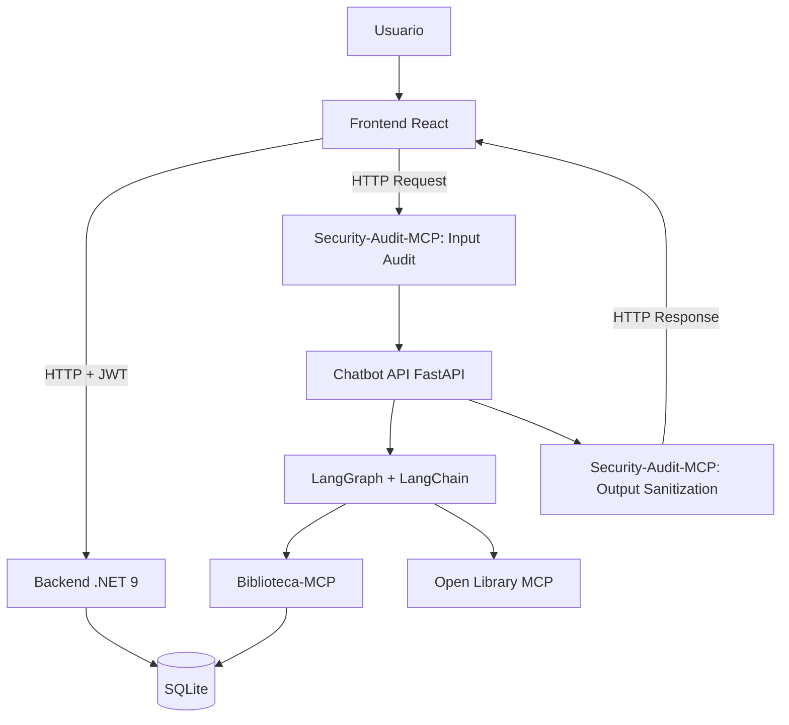

Trabajo Práctico Integrador — Sistema Web Fullstack con AI Engineering, MCP y Chatbot basado en Grafo.

---

## 1. Descripción general

**Biblioteca Virtual Inteligente** es una aplicación web fullstack diseñada para gestionar una biblioteca virtual. Permite administrar usuarios, roles, catálogo de libros, alquileres y notificaciones de vencimiento.

Como diferencial, integra un **chatbot inteligente** desarrollado con **LangChain + LangGraph**, apoyándose en el protocolo **MCP (Model Context Protocol)** para aislar la lógica de negocio y auditar la seguridad.

### Alcance Funcional (11 Casos de Uso Core)
1. Registro de cuenta (Público)
2. Inicio de sesión (JWT)
3. Gestión de roles y permisos (Admin)
4. Interfaz condicionada por roles y permisos (UX)
5. Búsqueda y filtrado de libros en catálogo
6. CRUD completo de libros (Admin/Bibliotecario)
7. Alquiler de libros con fecha límite de devolución
8. Generación automática de notificaciones de vencimiento próximo
9. Registro de devoluciones y liberación de stock
10. Chatbot inteligente con memoria persistente y grafo conversacional
11. Sala de lectura con acceso autorizado al libro alquilado, chatbot redimensionable y portadas robustas

---

## 2. Arquitectura Base



---

## 3. Desarrollo Evolutivo (AI Engineering)

Este proyecto se desarrolla de forma incremental mediante flujos automatizados de agentes de IA (OpenCode). No se escribe código de forma descontrolada, todo pasa por un estricto pipeline de aprobación.

### Ciclo de Vida de las Historias de Usuario
Cada nueva funcionalidad o requerimiento sigue de manera obligatoria esta secuencia orquestada mediante comandos específicos en el modo **Build**:

1. **Requerimiento (`create-user-story`)** El usuario ingresa una necesidad en lenguaje natural anteponiendo el comando.
2. **Historia de Usuario** El *Technical Lead* crea el archivo físico de la historia (`US-XXX`). El *Functional Analyst* redacta los criterios de aceptación y reglas de negocio.
3. **Planificación por roles (`plan-user-story`)** El *Architect* y los *Developers* trazan el plan técnico colaborativo sin tocar código.
4. **Actualización a 'Planned'** El sistema de control (MCP) registra la historia como planificada.
5. **Pregunta de Aprobación ➔** Compuerta de seguridad: el agente se detiene y pide autorización explícita para programar.
6. **Implementación incremental (`implement-user-story`)** Una vez aprobada explícitamente, los desarrolladores escriben el código exacto de ese incremento.
7. **Validación QA (`qa-check`) ➔** El agente de *QA* audita el código contra los criterios de aceptación y prueba el flujo.
8. **Actualización a 'Validated' ➔** Si pasa con éxito, se crea un *Pull Request* automático en GitHub y el estado se cierra.

```mermaid
gantt
    title Ciclo de Vida Inmutable de una Historia de Usuario (Gate-to-Gate)
    dateFormat  X
    axisFormat %s
    
    section 1. REQUERIMIENTO
    Crear Historia (Draft) :active, st1, 0, 10
    
    section 2. PLANIFICACIÓN
    Diseño & Plan de Roles :crit, st2, 10, 30
    Apertura Rama Git (Kebab-case) :st3, 20, 30
    Compuerta de Aprobación Usuario :milestone, st4, 30, 0
    
    section 3. IMPLEMENTACIÓN
    Código Incremental (In Progress) :st5, 30, 60
    Push automático a GitHub :st6, 55, 60
    
    section 4. CALIDAD (QA)
    Indexación Codebase & Testeo :crit, st7, 60, 80
    Apertura Automática de PR :st8, 75, 80
    Cierre e Integración (Validated) :milestone, st9, 80, 0
```



### Guía de Comandos y Estados del Pipeline (Flujo Inmutable)

| Fase | Comando Ejecutado | Rol Líder | Estado en MCP | Compuerta de Seguridad / Restricciones Estrictas |
| :--- | :--- | :--- | :--- | :--- |
| **1. Entrada** | `create-user-story "Como... Quiero... Para..."` | Technical Lead | `Draft` | El sistema valida la sintaxis y genera un ID único incremental (ej. `US-001`). |
| **2. Plan** | `plan-user-story "US-XXX"` | Technical Lead | `Planned` | **Prohibido modificar código.** Exige definir de forma interactiva la rama Git (`tipo/US-XXX-descripcion`). |
| **3. Aprobación** | `approve-user-story "US-XXX"` | Technical Lead | `Approved` | Avanza explícitamente la historia autorizando el comienzo de la programación. |
| **4. Build** | `implement-user-story "US-XXX"` | Technical Lead | `In Progress` `→` `Implemented` | Bloqueado si el estado no es `Approved` o `Rejected`. El agente escribe el incremento de código exacto y realiza un *push* directo y automatizado a la rama de la funcionalidad en GitHub. |
| **5. QA** | `qa-check "US-XXX"` | QA | `Validated` o `Rejected` | Ejecuta `index_repository` para analizar los cambios. Valida criterios de aceptación y documenta en el `.md`. Si pasa con éxito, abre un **Pull Request** automático hacia la rama main. Si falla, devuelve a `Rejected` y se detiene. |

**Nota de Cumplimiento** Cualquier intento de saltarse una fase, modificar código fuera de la fase *Build*, o utilizar nombres de ramas sin el formato reglamentario provocará el rechazo automático del comando por parte de los agentes.

---

## 4. Stack Tecnológico General

| Componente | Tecnología |
|---|---|
| Frontend | React 18 + TypeScript + Vite + Tailwind CSS + shadcn/ui + Zustand + React Router |
| Backend | C# / .NET 9 / ASP.NET Core Web API / EF Core / SQLite / Identity + JWT |
| IA & Chatbot | Python / FastAPI / LangChain / LangGraph |
| MCP | Python + FastMCP (Biblioteca-MCP, Security-Audit-MCP, Open Library MCP) |
| Orquestación | Docker Compose |

---

## 5. Project Structure

```
├── docker-compose.yml              # Orquestación de todos los servicios (env requeridas)
├── .env.example                   # Plantilla de variables de entorno (copiar a .env)
├── workflow/
│   ├── backend/                     # .NET 9 Clean Architecture (README propio)
│   ├── frontend/                    # React 18 + TypeScript + Vite (README propio)
│   ├── chatbot/                     # FastAPI + LangChain + LangGraph (README propio)
│   ├── mcp/                         # Servidores MCP (README propio)
│   ├── database/                    # Archivos SQLite
│   └── opencode/                    # User stories, AI Engineering logs, instrucciones
├── project-memory-mcp/              # Servidor MCP del ciclo de vida de historias
└── .opencode/                       # Instrucciones, memoria de decisiones, skills
```

---

## 6. Documentación por módulo

El detalle técnico de cada componente vive en su propio README:

| Módulo | Documentación |
|---|---|
| Backend (.NET 9) | [`workflow/backend/README.md`](workflow/backend/README.md) — arquitectura, env, endpoints, seed |
| Frontend (React) | [`workflow/frontend/README.md`](workflow/frontend/README.md) — env, roles/UX, chatbot, tema |
| Chatbot (FastAPI) | [`workflow/chatbot/README.md`](workflow/chatbot/README.md) — grafo, LLM, clientes MCP |
| Servidores MCP | [`workflow/mcp/README.md`](workflow/mcp/README.md) — configuración y herramientas |
| Decisiones de arquitectura | [`.opencode/memory/DECISIONS.md`](.opencode/memory/DECISIONS.md) — ADR-001 a ADR-037 |

---

## 7. Prerrequisitos y Configuración del Entorno

### 7.1 Variables de entorno (.env)

Para arrancar el stack con Docker y para que la automatización y los servidores MCP funcionen correctamente, crea un archivo `.env` en la raíz del proyecto a partir de la plantilla:

```bash
cp .env.example .env
```

**Toda la configuración se maneja por variables de entorno (fail-fast):** no hay valores por defecto hardcodeados ni en código ni en las imágenes Docker (ADR-025). Si falta una variable requerida, `docker compose up` aborta con un mensaje claro indicando cuál es. El `.env` está excluido de Git (`.gitignore`); la plantilla `.env.example` **sí** está versionada y solo contiene placeholders, nunca secretos reales.

> **Importante (Docker):** si ya existen contenedores o imágenes previas del stack, **debes recrearlos** para aplicar la nueva configuración de variables: `docker compose down` seguido de `docker compose up --build`. Construir de nuevo la imagen sobrescribe la existente (mismo tag `:stable`) en lugar de crear imágenes nuevas con tags distintos.

### 7.2 Codebase Memory MCP

Para que los agentes de IA puedan explorar la arquitectura del proyecto de forma autónoma, este repositorio depende de Codebase Memory MCP, instalado a nivel global:

```bash
sudo npm install -g codebase-memory-mcp   # Linux/macOS
npm install -g codebase-memory-mcp        # Windows (administrador)
```

Nota: el archivo `opencode.json` asume que `codebase-memory-mcp` está disponible globalmente en el PATH. Versión con UI: `codebase-memory-mcp --ui=true --port=9749` → `http://localhost:9749`.

### 7.3 Dependencias MCP locales

Los servidores de Ciclo de Vida, Dominio y Seguridad corren en la máquina anfitriona para la orquestación de IA:

```bash
cd project-memory-mcp && npm install && cd ..
python -m venv .venv && source .venv/bin/activate   # opcional pero recomendado
pip install mcp fastmcp
```

---

## 8. Ejecución local rápida (Docker)

```bash
cp .env.example .env
# Completar las variables requeridas (ver .env.example y READMEs de módulo)
docker compose up --build
```

| Servicio | URL | Puerto host |
|---|---|---|
| Frontend (Nginx + SPA) | http://localhost:5173 | 5173 |
| Backend API (.NET 9) | http://localhost:5000 | 5000 |
| Chatbot API (FastAPI) | http://localhost:8000 | 8000 |
| SQLite | volumen `database_data` en `/app/database` | — |

En el primer arranque el backend siembra roles/permisos y el usuario administrador definido por `ADMIN_EMAIL`/`ADMIN_PASSWORD`; el JWT se firma con `JWT_KEY`. La base SQLite persiste en el volumen Docker `database_data`.

Para desarrollo local sin Docker (backend, frontend, chatbot por separado), consulta los READMEs de cada módulo.

---

## 9. Datos de ejemplo (seed)

El catálogo se siembra con ~50 obras reales desde la fuente única `workflow/backend/data/seed-books.json` al arrancar el backend (solo si la tabla `Books` está vacía, idempotente — ADR-019). Distribución por 9 géneros y variación de copias (incluye algún libro con 0 copias para ejercitar el filtro "Solo disponibles").

**Semántica de "disponible en Open Library":** la obra existe en Open Library y el título devuelto coincide con el sembrado (comparación normalizada). NO implica disponibilidad de préstamo. Es una tarea de desarrollo/QA (`workflow/mcp/open-library-mcp/verify_seed_open_library.py`); la app en runtime no consulta Open Library (ADR-007/020).

---

## 10. Identidad visual

La SPA usa la identidad **"Sala de lectura"** (librería tradicional): paleta cálida y añeja (pergamino, madera, latón, oliva), tipografía Fraunces + Lora, y portadas derivadas en cliente desde ISBN/OLID con fallback ornamental. Cambio de presentación únicamente (ADR-021). Detalle en `workflow/frontend/README.md`.

---

## 11. Notas de versiones recientes (US-011 a US-014)

- **US-011:** Sala de lectura (`/sala-lectura/:bookId`), chatbot redimensionable y portadas robustas.
- **US-012:** Chatbot con recomendaciones personalizadas, feedback persistido (`registrar_feedback`) y LLM local Ollama (llama3.2) para las recomendaciones, con PII masking, auditoría GROQ obligatoria y fallback heurístico (ADR-022/023/029).
- **US-013:** Notificaciones automáticas de vencimiento (`RentalDueNotificationService`, tabla `Notifications`, endpoints `GET/PATCH /api/notifications`).
- **US-014:** Documentación por módulo, configuración fail-fast por variables de entorno (ADR-025), rol Admin sin alquiler, acción «Alquilar» en el catálogo para usuarios y chatbot minimizado por defecto.
- **US-015/016/017/018/019:** CI sobre todo el stack (ADR-028), Ollama local para recomendaciones y GROQ solo auditoría (ADR-029), 3 MCP empaquetados en la imagen del chatbot (ADR-030), CORS del chatbot (ADR-031), Ollama nativo del host (ADR-032), rutas de BD por `env_file` + reintento Open Library (ADR-033), auditoría degradada sin `[REDACTED]` (ADR-034) y memoria conversacional con `follow_up` (ADR-035).
- **US-020 (post-E2E):** contrato `userId` case-insensitive (ADR-037), modelo auditoría GROQ final `openai/gpt-oss-20b` (ADR-036), smalltalk con prompt dedicado (sin recomendaciones inventadas), limpieza de residuo E2E en SQLite runtime y propagación de `GROQ_MODEL`/contrato `userId` a compose/CI/docs.

Detalle técnico de cada historia en los READMEs de módulo y en `workflow/opencode/user-stories/`.

---

## 12. CI/CD

El pipeline de GitHub Actions (`.github/workflows/ci.yml`) valida todo el stack en `push` y `pull_request` con tres jobs:

- **`backend`:** `dotnet restore` + `dotnet build --no-restore --configuration Release` (`.NET 9`).
- **`frontend`:** `npm ci` + `npm run build` inyectando las variables de build-time requeridas por el fail-fast (ADR-025): `VITE_API_BASE_URL` (`http://localhost:5000`) y `VITE_CHATBOT_API_BASE_URL` (`http://localhost:8000`). Sin secretos.
- **`python`:** instala las dependencias de chatbot y de los tres MCP (`workflow/chatbot`, `workflow/mcp/biblioteca-mcp`, `workflow/mcp/open-library-mcp`, `workflow/mcp/security-audit-mcp`) y ejecuta `pytest` sobre las suites de chatbot y MCP (**154 tests** — chatbot 103, biblioteca-mcp 15, open-library-mcp 18, security-audit-mcp 18 —, autocontenidos, sin red ni API keys). El job de security-audit-mcp define `GROQ_MODEL=openai/gpt-oss-20b` y `GROQ_TIMEOUT_SECONDS=10` como variables de entorno del workflow (ADR-036), sin secretos.

Los valores de CI son variables de entorno de build del workflow (no defaults hardcodeados en código) — ver ADR-028 en `DECISIONS.md`.
