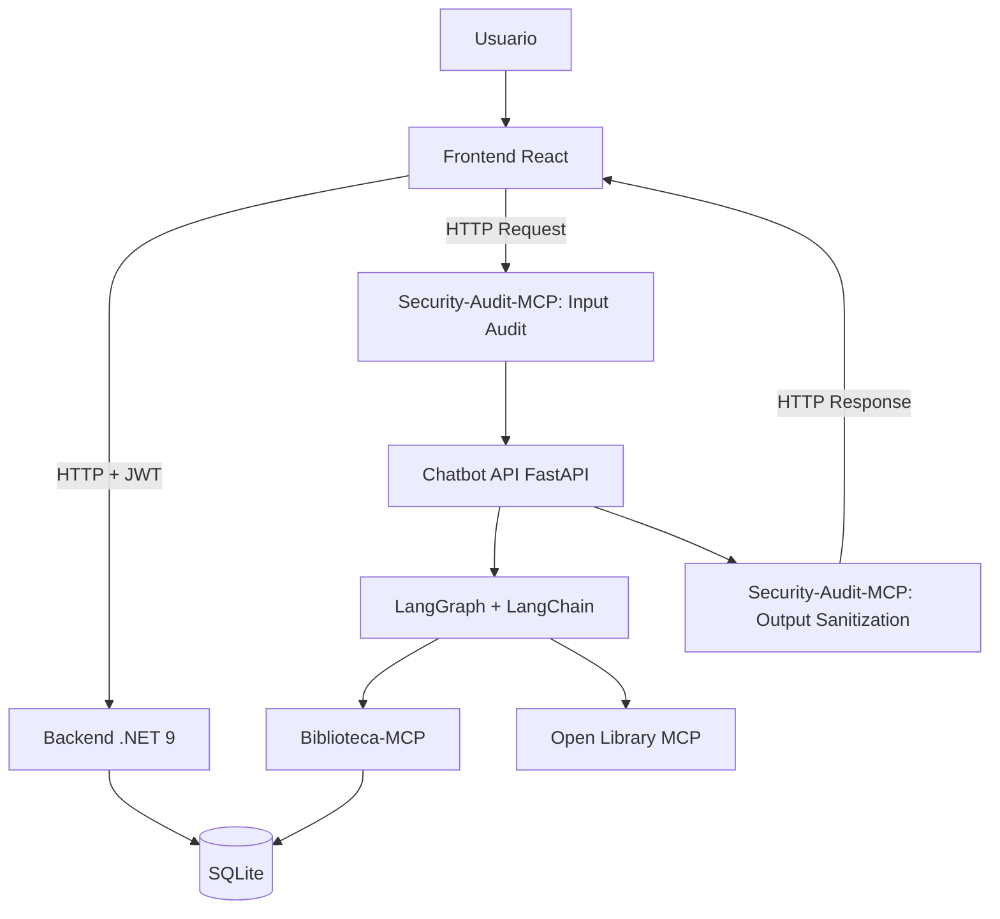

Trabajo Práctico Integrador — Sistema Web Fullstack con AI Engineering, MCP y Chatbot basado en Grafo.

---

## 1. Descripción general

**Biblioteca Virtual Inteligente** es una aplicación web fullstack diseñada para gestionar una biblioteca virtual. Permite administrar usuarios, roles, catálogo de libros, alquileres y notificaciones de vencimiento.

Como diferencial, integra un **chatbot inteligente** desarrollado con **LangChain + LangGraph**, apoyándose en el protocolo **MCP (Model Context Protocol)** para aislar la lógica de negocio y auditar la seguridad.

### Alcance Funcional (11 Casos de Uso Core)
1. Registro de cuenta (Público)
2. Inicio de sesión (JWT)
3. Gestión de roles y permisos (Admin)
4. Interfaz condicionada por roles y permisos (UX)
5. Búsqueda y filtrado de libros en catálogo
6. CRUD completo de libros (Admin/Bibliotecario)
7. Alquiler de libros con fecha límite de devolución
8. Generación automática de notificaciones de vencimiento próximo
9. Registro de devoluciones y liberación de stock
10. Chatbot inteligente con memoria persistente y grafo conversacional
11. Sala de lectura con acceso autorizado al libro alquilado, chatbot redimensionable y portadas robustas

---

## 2. Arquitectura Base


    
---

## 3. Desarrollo Evolutivo (AI Engineering)

Este proyecto se desarrolla de forma incremental mediante flujos automatizados de agentes de IA (OpenCode). No se escribe código de forma descontrolada, todo pasa por un estricto pipeline de aprobación.

### Ciclo de Vida de las Historias de Usuario
Cada nueva funcionalidad o requerimiento sigue de manera obligatoria esta secuencia orquestada mediante comandos específicos en el modo **Build**:

1. **Requerimiento (`create-user-story`)** El usuario ingresa una necesidad en lenguaje natural anteponiendo el comando.
2. **Historia de Usuario** El *Technical Lead* crea el archivo físico de la historia (`US-XXX`). El *Functional Analyst* redacta los criterios de aceptación y reglas de negocio.
3. **Planificación por roles (`plan-user-story`)** El *Architect* y los *Developers* trazan el plan técnico colaborativo sin tocar código.
4. **Actualización a 'Planned'** El sistema de control (MCP) registra la historia como planificada.
5. **Pregunta de Aprobación ➔** Compuerta de seguridad: el agente se detiene y pide autorización explícita para programar.
6. **Implementación incremental (`implement-user-story`)** Una vez aprobada explícitamente, los desarrolladores escriben el código exacto de ese incremento.
7. **Validación QA (`qa-check`) ➔** El agente de *QA* audita el código contra los criterios de aceptación y prueba el flujo.
8. **Actualización a 'Validated' ➔** Si pasa con éxito, se crea un *Pull Request* automático en GitHub y el estado se cierra.

```mermaid
gantt
    title Ciclo de Vida Inmutable de una Historia de Usuario (Gate-to-Gate)
    dateFormat  X
    axisFormat %s
    
    section 1. REQUERIMIENTO
    Crear Historia (Draft) :active, st1, 0, 10
    
    section 2. PLANIFICACIÓN
    Diseño & Plan de Roles :crit, st2, 10, 30
    Apertura Rama Git (Kebab-case) :st3, 20, 30
    Compuerta de Aprobación Usuario :milestone, st4, 30, 0
    
    section 3. IMPLEMENTACIÓN
    Código Incremental (In Progress) :st5, 30, 60
    Push automático a GitHub :st6, 55, 60
    
    section 4. CALIDAD (QA)
    Indexación Codebase & Testeo :crit, st7, 60, 80
    Apertura Automática de PR :st8, 75, 80
    Cierre e Integración (Validated) :milestone, st9, 80, 0
```



### Guía de Comandos y Estados del Pipeline (Flujo Inmutable)

El desarrollo está completamente automatizado y gobernado por el servidor de ciclo de vida. Cada funcionalidad debe atravesar de forma obligatoria las siguientes transiciones de estado mediante comandos secuenciales en la terminal:

| Fase | Comando Ejecutado | Rol Líder | Estado en MCP | Compuerta de Seguridad / Restricciones Estrictas |
| :--- | :--- | :--- | :--- | :--- |
| **1. Entrada** | `create-user-story "Como... Quiero... Para..."` | Technical Lead | `Draft` | El sistema valida la sintaxis y genera un ID único incremental (ej. `US-001`). |
| **2. Plan** | `plan-user-story "US-XXX"` | Technical Lead | `Planned` | **Prohibido modificar código.** Coordina el diseño entre analistas y arquitectos. Exige definir de forma interactiva la rama Git (`tipo/US-XXX-descripcion`). |
| **3. Aprobación** | `approve-user-story "US-XXX"` | Technical Lead | `Approved` | Avanza explícitamente la historia autorizando el comienzo de la programación. |
| **4. Build** | `implement-user-story "US-XXX"` | Technical Lead | `In Progress` $\rightarrow$ `Implemented` | Bloqueado si el estado no es `Approved` o `Rejected`. El agente escribe el incremento de código exacto y realiza un *push* directo y automatizado a la rama de la funcionalidad en GitHub. |
| **5. QA** | `qa-check "US-XXX"` | QA | `Validated` o  `Rejected` | Ejecuta `index_repository` para analizar los cambios. Valida criterios de aceptación y documenta en el `.md`. Si pasa con éxito, abre un **Pull Request** automático hacia la rama main. Si falla, devuelve a `Rejected` y se detiene. |

**Nota de Cumplimiento** Cualquier intento de saltarse una fase, modificar código fuera de la fase *Build*, o utilizar nombres de ramas sin el formato reglamentario provocará el rechazo automático del comando por parte de los agentes.

**Nota sobre la documentación técnica**
La documentación detallada, endpoints y configuraciones de cada componente no están centralizadas aquí. El rol de **Technical Writer** creará y actualizará automáticamente los archivos `README.md` dentro de cada módulo (`/backend`, `/frontend`, `/chatbot`, `/mcp`) **a medida que el código atraviese este ciclo y sea validado**.

---

## 4. Stack Tecnológico General

- Frontend: React, TypeScript, Tailwind CSS.
- Backend: C#, .NET 9, ASP.NET Core Web API, EF Core, SQLite.
- IA & Chatbot: Python, FastAPI, LangChain, LangGraph.
- Orquestación: Model Context Protocol (MCP), Docker Compose.


---

## 5. Project Structure

```
├── docker-compose.yml              # Docker Compose for all services
├── .env.example                   # Plantilla de variables de entorno (copiar a .env)
├── workflow/
│   ├── backend/                     # .NET 9 Clean Architecture
│   │   ├── BibliotecaVirtual.slnx
│   │   ├── .dockerignore
│   │   └── src/
│   │       ├── BibliotecaVirtual.Domain/       # Entities, Enums, ValueObjects, Interfaces
│   │       ├── BibliotecaVirtual.Application/  # CQRS, Commands, Queries, Validators
│   │       ├── BibliotecaVirtual.Infrastructure/ # EF Core DbContext, Services
│   │       └── BibliotecaVirtual.Api/          # Controllers, Middleware, Program.cs
│   ├── frontend/                    # React 18 + TypeScript + Vite
│   │   ├── Dockerfile
│   │   ├── nginx.conf              # Nginx server: SPA fallback + cache de assets
│   │   ├── .dockerignore
│   │   └── src/
│   │   │   ├── routes/             # Route components
│   │   │   ├── components/         # UI components
│   │   │   ├── services/           # API client services
│   │   │   ├── types/              # TypeScript type definitions
│   │   │   └── lib/                # Utility functions
│   │   └── ...
│   ├── chatbot/                     # FastAPI + LangChain + LangGraph
│   │   ├── main.py
│   │   ├── requirements.txt
│   │   └── app/
│   │       ├── graph/              # LangGraph nodes
│   │       ├── prompts/            # Prompt templates
│   │       ├── mcp_clients/        # MCP client wrappers
│   │       └── services/           # Business services
│   ├── mcp/
│   │   ├── biblioteca-mcp/         # Domain MCP server
│   │   └── security-audit-mcp/     # Security MCP server
│   ├── database/                    # SQLite database files
│   └── opencode/                    # User stories, AI engineering logs
```

---

## 6. Prerrequisitos y Configuración del Entorno

### 6.1 Configuración de Variables de Entorno (.env)

Para arrancar el stack con Docker y para que la automatización y los servidores MCP funcionen correctamente, crea un archivo `.env` en la raíz del proyecto a partir de la plantilla:

```bash
cp .env.example .env
```

Completa al menos los valores obligatorios marcados abajo. El `.env` está excluido de Git (`.gitignore`); la plantilla `.env.example` **sí** está versionada y solo contiene placeholders, nunca secretos reales.

| Variable | Requerida | Valor por defecto | Consumidor |
|---|---|---|---|
| `GITHUB_TOKEN` | Sí | — | Automatización GitHub/`qa-check` |
| `DATABASE_PATH` | Sí | `./workflow/database/BibliotecaVirtual.db` | MCPs Python (Biblioteca-MCP, Security-Audit-MCP) |
| `JWT_KEY` | Sí | — (generar con `openssl rand -base64 48`) | Backend (firma JWT; `Jwt__Key`) |
| `ADMIN_EMAIL` | Sí | `admin@biblioteca.local` | Backend (seeding admin) |
| `ADMIN_PASSWORD` | Sí | — (≥ 8 chars, 1 mayúscula, 1 dígito) | Backend (seeding admin) |
| `VITE_API_BASE_URL` | Sí (Docker) | `http://localhost:5000` | Frontend Vite (build arg) |
| `AUTH_RATE_LIMIT_PER_MINUTE` | No | `10` | Backend (rate limiter `auth`) |
| `SQLITE_DATA_SOURCE` | No | vacío (usa el connection string por defecto) | Backend (connection string SQLite) |
| `CHATBOT_HOST` | No | `0.0.0.0` | Chatbot (uvicorn) |
| `CHATBOT_PORT` | No | `8000` | Chatbot (uvicorn) |
| `LLM_API_KEY` | No (futura) | — | Chatbot (LLM provider, sin cablear todavía) |
| `LLM_API_URL` | No (futura) | — | Chatbot (LLM provider) |
| `LLM_MODEL` | No (futura) | — | Chatbot (LLM provider) |
| `LLM_TEMPERATURE` | No (futura) | `0.7` | Chatbot (LLM provider) |
| `LLM_TIMEOUT_SECONDS` | No (futura) | `60` | Chatbot (LLM provider) |
| `CHATBOT_CORS_ORIGINS` | No (futura) | `http://localhost:5173` | Chatbot (CORS) |

> **Importante (Docker):** si ya existen contenedores o imágenes previas del stack, **debes recrearlos** para aplicar la nueva configuración de variables: `docker compose down` seguido de `docker compose up --build`. Construir de nuevo la imagen sobrescribe la existente (mismo tag `:stable`) en lugar de crear imágenes nuevas con tags distintos.

### 6.2 Codebase Memory MCP
Para que los agentes de IA puedan explorar la arquitectura del proyecto de forma autónoma, este repositorio depende de Codebase Memory MCP, el cual debe estar instalado a nivel global en tu sistema.

Dependiendo de tu sistema operativo, asegúrate de tener Node.js instalado y ejecuta el siguiente comando en tu terminal:

Linux & macOS:

**Linux & macOS:**
```bash
sudo npm install -g codebase-memory-mcp
```

**Windows (Ejecutar CMD o PowerShell como Administrador):**
```bash
npm install -g codebase-memory-mcp
```

Nota: El archivo opencode.json de este proyecto asume que el comando `codebase-memory-mcp` está disponible globalmente en tu variable de entorno PATH.

#### Versión con UI

```bash
codebase-memory-mcp --ui=true --port=9749
```
Luego abre en el navegador:
```bash
http://localhost:9749
```

### 6.3 Configuración Local para Desarrollo

#### Backend (.NET 9)

```bash
# Navegar al directorio del backend
cd workflow/backend

# Restaurar paquetes NuGet
dotnet restore

# Compilar la solución
dotnet build

# Ejecutar la API (Swagger en /swagger)
dotnet run --project src/WebAPI
```

La API estará disponible en `http://localhost:5000/swagger` (desarrollo local). La base de datos SQLite se crea automáticamente en `workflow/database/`.

**Variables de entorno del backend:**

- `AUTH_RATE_LIMIT_PER_MINUTE` (default `10`): límite de la policy `auth` del rate limiter (register/login/refresh/revoke) por ventana de 1 minuto. Eleva el valor para baterías de pruebas que disparen ráfagas sin falsos `429`.
- `SQLitePCLRaw.lib.e_sqlite3` está pinnado a `2.1.12` para mitigar `NU1903` (GHSA-2m69-gcr7-jv3q). Las versiones parcheadas actuales requieren glibc ≥ 2.34; si tu host usa glibc antiguo (p. ej. Debian 11, glibc 2.31), ejecuta el backend vía Docker (`docker compose up --build backend`) — la imagen `dotnet/aspnet:10.0` incluye glibc compatible.

#### Frontend (React + TypeScript + Vite)

```bash
# Navegar al directorio del frontend
cd workflow/frontend

# Instalar dependencias
npm install

# Iniciar servidor de desarrollo
npm run dev
```

El frontend estará disponible en `http://localhost:5173`.

---

### 6.5 Instalación de Dependencias MCP (Local)
Aunque la aplicación final se ejecuta en Docker, la orquestación de IA y los servidores MCP que interactúan con tu código deben correr directamente en tu máquina anfitriona. Antes de iniciar cualquier flujo, instala las dependencias necesarias:

**1. Servidor de Ciclo de Vida (Node.js)**
Responsable de gestionar el estado de las Historias de Usuario.
```bash
cd project-memory-mcp
npm install
cd ../..
```

**2. Servidores de Dominio y Seguridad (Python)**

Responsables de auditar la seguridad (`Security-Audit-MCP`) y conectar el chatbot con la base de datos (`Biblioteca-MCP`). Asegúrate de tener Python 3.10+ instalado.

## Crear entorno virtual en la raíz (opcional pero recomendado)
```bash
python -m venv .venv
source .venv/bin/activate  # En Windows: .venv\Scripts\activate
```

## Instalar dependencias para los servidores MCP de Python
```bash
pip install mcp fastmcp
```

---

## 7. Ejecución local rápida (Docker)

El proyecto está preparado para levantarse por completo mediante contenedores para la aplicación (Frontend, Backend, Chatbot):

**1. Crear el archivo `.env` a partir de la plantilla:**

```bash
cp .env.example .env
# Completar JWT_KEY (openssl rand -base64 48) y ADMIN_PASSWORD (>= 8 chars, 1 mayúscula, 1 dígito)
```

> El backend requiere `JWT_KEY`, `ADMIN_EMAIL` y `ADMIN_PASSWORD` para arrancar (fail-fast). Sin `.env`, el comando de compose aborta con un mensaje claro.
>
> **Si ya existen contenedores o imágenes previas del stack**, debes recrearlos para que la nueva configuración se aplique: `docker compose down` y a continuación `docker compose up --build`. Al construir, la imagen se sobrescribe con el mismo tag estable (`biblioteca-virtual-<servicio>:stable`), sin acumular tags huérfanos.

**2. Levantar el stack:**

```bash
docker compose up --build
```

| Servicio | URL | Puerto contenedor | Puerto host |
|---|---|---|---|
| Frontend (Nginx + SPA) | http://localhost:5173 | 5173 | 5173 |
| Backend API (.NET 9) | http://localhost:5000 | 5000 | 5000 |
| Chatbot API (FastAPI) | http://localhost:8000 | 8000 | 8000 |
| SQLite | — | volumen `database_data` en `/app/database` | — |

Notas:
- El contenedor del frontend sirve la SPA con fallback para rutas de React Router (refrescar `/login` no devuelve 404) y embebe la URL base de la API `http://localhost:5000` en el bundle (build arg `VITE_API_BASE_URL`).
- En el primer arranque el backend siembra roles/permisos y el usuario administrador definido por `ADMIN_EMAIL`/`ADMIN_PASSWORD`; el JWT se firma con `JWT_KEY`.
- La base SQLite persiste en el volumen Docker `database_data` (`./workflow/database/` solo para desarrollo local, fuera de contenedores).
- Para detener: `docker compose down` (añade `-v` si quieres eliminar también el volumen de datos).

---

## 8. Datos de ejemplo (seed)

El catálogo se siembra con datos de ejemplo al arrancar el backend, a partir de la fuente única `workflow/backend/data/seed-books.json`:

- **Inventario:** ~50 obras reales (mayormente clásicos de dominio público) con `Title`, `Author`, `Isbn` (ISBN-13), `Genre`, `Description`, `OpenLibraryKey`, `TotalCopies` y `AvailableCopies`.
- **Distribución por géneros:** 9 géneros (Novela, Clásicos, Aventura, Ciencia Ficción, Fantasía, Historia, Ensayo, Terror, Poesía) para ejercitar el filtro y la búsqueda del catálogo.
- **Variación de copias:** `TotalCopies` entre 1 y 5; al menos un libro con 0 copias disponibles para ejercitar el filtro "Solo disponibles" y el badge de disponibilidad.
- **Regeneración idempotente:** el seed solo inserta si la tabla `Books` está vacía (mismo patrón que roles/administrador); no duplica al rearrancar. Para regenerar, borra el archivo `.db` correspondiente (se recrea esquema + seed). Controlable con `CatalogSeed:Enabled` / `CatalogSeed:FilePath`.

**Semántica de "disponible en Open Library":** la obra existe en Open Library y el título devuelto coincide con el sembrado (comparación normalizada). NO implica disponibilidad de préstamo. La verificación es una tarea de desarrollo/QA (script `workflow/scripts/verify_seed_open_library.py` vía el MCP `ol_verify_by_isbn`); la app en runtime no consulta Open Library (ADR-007/020).

## 9. Identidad visual

La SPA usa la identidad "Sala de lectura" (librería tradicional) definida exclusivamente en el frontend mediante tokens bajo `src/index.css` (light `:root` + `.dark`):

- **Paleta cálida y añeja:** fondos crema/pergamino, marrones de madera/cuero (espresso, wine, wood), acentos ámbar/dorado (brass, ochre) y verde musgo (olive).
- **Tipografía:** Fraunces Variable (display/serif) y Lora Variable (cuerpo).
- **Portadas:** derivadas en cliente desde ISBN/OLID (`covers.openlibrary.org`) con fallback ornamental en caso de error o de imagen en blanco (el servidor de portadas devuelve un placeholder en blanco, no un 404; se detecta por tamaño natural de la imagen en el componente `BookCover`).
- **Alcance:** cambio de presentación únicamente; no altera rutas, guardias de permisos, lógica de negocio ni contratos de API (ADR-021).

## 10. Sala de lectura y UX (US-011)

- **Sala de lectura (`/sala-lectura/:bookId`):** un usuario con un alquiler NO devuelto (`Active` o `Overdue`) puede leer el libro desde la acción "Leer" en "Mis alquileres". La autorización se valida en el backend: `GET /api/books/{bookId}/reading` (JWT + policy `books.read`) devuelve el libro y su descripción únicamente si el solicitante tiene un alquiler no devuelto del libro; en caso contrario responde 404. El contenido de lectura es la descripción persistida del libro.
- **Chatbot redimensionable:** la ventana del asistente se puede agrandar/achicar con el botón de expandir/colapsar y con las asas de redimensionado (borde izquierdo para ancho, borde inferior para alto), con teclado accesible. El tamaño elegido se persiste entre navegaciones (Zustand + `localStorage`).
- **Portadas robustas:** componente reutilizable `BookCover` con skeleton de carga, detección de portada en blanco y fallback ornamental (`CoverOrnament`).
